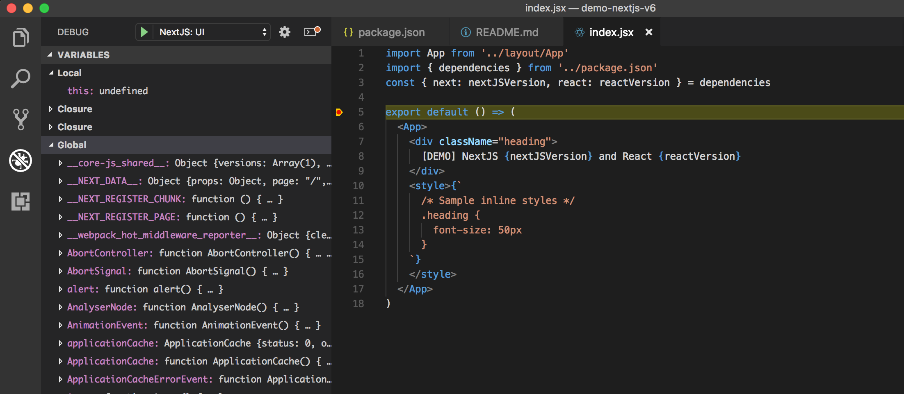
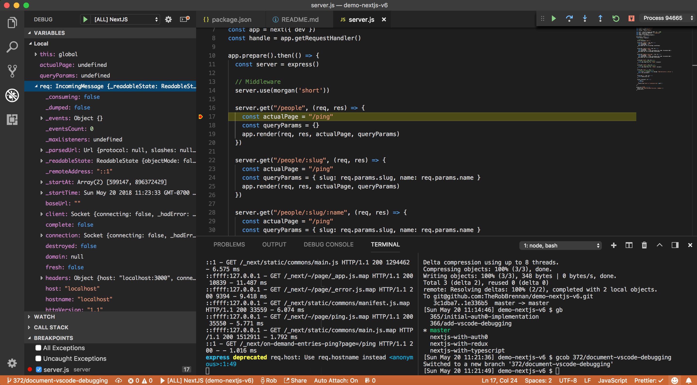
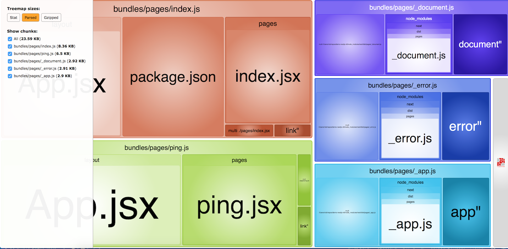
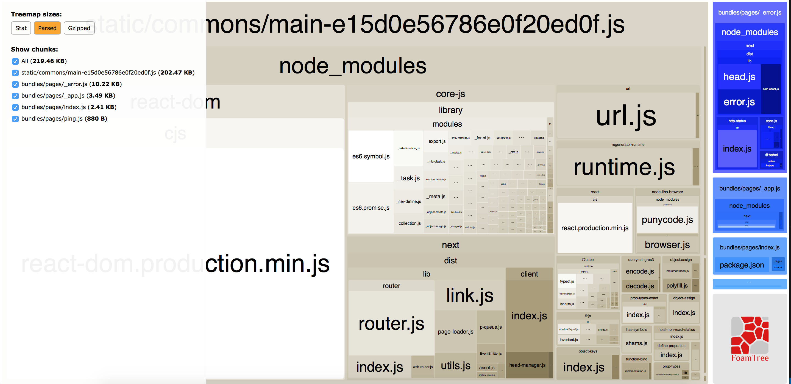
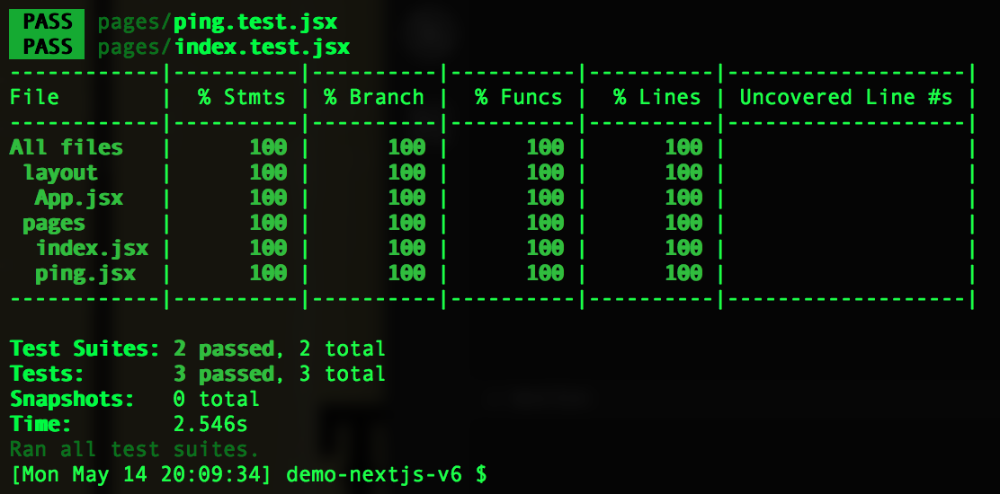
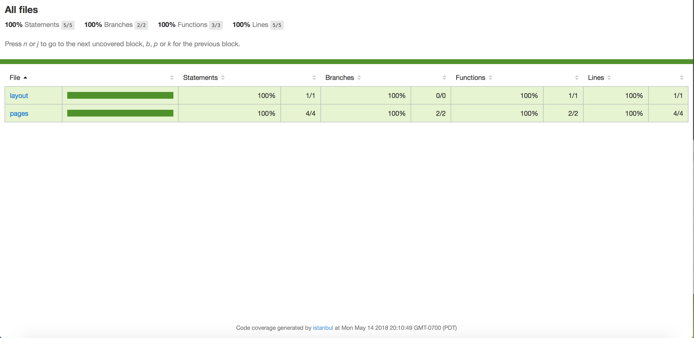

# Welcome
This is a simple demo to explore NextJS v6 with support for:
+ [Jest](https://facebook.github.io/jest/) / [Enzyme](http://airbnb.io/enzyme/)
+ [Redux](https://redux.js.org) (1)
    - [Redux DevTools](https://github.com/zalmoxisus/redux-devtools-extension)
        + Currently supports viewing and debugging your Redux store in
            - Chrome
            - Firefox
            - Electron
        + Please see [remote-redux-devtools](https://github.com/zalmoxisus/remote-redux-devtools) for other browsers/environments
+ [TypeScript](https://www.typescriptlang.org) (2)
+ [Auth0](https://auth0.com) (3)
+ [Webpack](https://webpack.js.org)

[](https://codeclimate.com/github/TheRobBrennan/demo-nextjs-v6/maintainability)
[](https://codeclimate.com/github/TheRobBrennan/demo-nextjs-v6/test_coverage)


(1) - The `master` branch of this project **does not include** Redux. If you would like to explore my Redux demo code, please checkout branch `nextjs-with-redux` instead.

(2) - The `master` branch of this project **does not include** TypeScript. If you would like to explore my TypeScript demo code, please checkout branch `nextjs-with-typescript` instead.

(3) - The `master` branch of this project **does not include** the Auth0 demo. If you would like to explore the Auth0 demo code, please checkout branch `nextjs-with-auth0` instead.

If you are using [VS Code](https://code.visualstudio.com) as your editor, this project will allow you to debug the front-end NextJS UI, the back-end ExpressJS server, or both while your local server is running:



This project also includes a helper script that will enable you to interactively explore what is contained within your production app. Simply run:

```sh
$ npm run analyze
```

This will generate an interactive tool to see what the generated bundles for your app contain:



My initial goal is to start with a clean slate and see how new features and functionality in [NextJS v6](https://nextjs.org) can be incorporated.

If you would like to see work from my previous NextJS 5 demos, please visit [demo-nextjs-v5-without-typescript](https://github.com/TheRobBrennan/demo-nextjs-v5-without-typescript) and/or [demo-nextjs-v5](https://github.com/TheRobBrennan/demo-nextjs-v5).

# Getting started
## Initial setup and installation
To get started with [NextJS v6](https://nextjs.org), all you need to do is clone this repo and run the install script:

    $ git clone git@github.com:TheRobBrennan/demo-nextjs-v6.git
    $ cd demo-nextjs-v6
    $ npm install

If you are developing on either macOS or Linux, you can move on to "Start your local development server."

If you are developing on Windows, I would encourage you to use the `nextjs-for-windows-powershell-development` branch as your starting point. [@victorprocure](https://github.com/victorprocure) made a great contribution in [Cross Development Build #32](https://github.com/TheRobBrennan/demo-nextjs-v6/pull/32) - which makes this starter project super friendly for people developing on Windows machines:

    $ git checkout nextjs-for-windows-powershell-development

## Start your local development server
Once you have cloned the repo and installed the required dependencies, you can start NextJS by running:

    $ npm run dev

Once you see `> Ready on http://localhost:3000`, you can view your app at [http://localhost:3000](http://localhost:3000)

TIP: If you would like to run your application on a port other than the default `3000`, you can run:

    $ npm run dev -- -p <your port here>

Your development server will constantly reload as changes are made to your app.

## ExpressJS server
This demo uses a lightweight ExpressJS server - `server.js` - to demonstrate how to:

+ Create an endpoint (for an API, as an example) that does not use NextJS
+ Server-side render (SSR) NextJS pages
+ Server side render (SSR) custom route/paths with NextJS

### Endpoint that does not use NextJS
#### /test
This example path is a route that our NextJS app knows absolutely nothing about. It is purely handled by our Express server. You can ping this route to verify that the server is available.

### Server side rendering (SSR) for NextJS pages
#### /ping
This is simple server side rendering (SSR) for the `ping.jsx` page

### Server side rendering (SSR) for custom routes
This example uses the `ping.jsx` as the page we want to render when handling custom routes.

#### Client configuration
In `layout/App.jsx` notice that we have the following code block:

```sh
      <Link as={`/people`} href={`/ping`}><a>People</a></Link>&nbsp;
      <Link as={`/people/developers`} href={`/ping?slug=developers`}><a>Developers</a></Link>&nbsp;
      <Link as={`/people/developers/rob`} href={`/ping?slug=developers&name=rob`}><a>Rob</a></Link>&nbsp;
```

This tells NextJS that these links will render the `ping.jsx` page, but that we want the URLs to appear as `/people/...` and not just a link to `/ping?slug=developers&name=rob`.

This setup will work fine on the client side...until they try to access the `/people/...` route directly or refresh the web page. To get that to work, we need to modify our lightweight server to explicitly handle those routes.

#### Server configuration
Notice that in our `./server/server.js` file we have the following block of code:

```sh
    server.get('/people', (req, res) => {
      const actualPage = '/ping'
      const queryParams = { }
      app.render(req, res, actualPage, queryParams)
    })

    server.get('/people/:slug', (req, res) => {
      const actualPage = '/ping'
      const queryParams = { slug: req.params.slug, name: req.params.name }
      app.render(req, res, actualPage, queryParams)
    })

    server.get('/people/:slug/:name', (req, res) => {
      const actualPage = '/ping'
      const queryParams = { slug: req.params.slug, name: req.params.name }
      app.render(req, res, actualPage, queryParams)
    })
```

All three of these custom routes render the `ping.jsx` page with the appropriate parameters passed in. This means the user will be able to navigate to the following example URLs in their browser OR by forcing a hard refresh on the server:

+ /people
+ /people/developers
+ /people/developers/rob

### Testing
This project uses [jest](https://facebook.github.io/jest/) and [enzyme](http://airbnb.io/enzyme/) for testing your React application - and should have high levels of code coverage.

For testing, we have the following scripts I have lovingly crafted in our main `package.json` file:

```sh
    "test": "./node_modules/.bin/jest --no-cache",
    "test:debug": "./node_modules/.bin/jest --debug",
    "test:verbose": "./node_modules/.bin/jest --verbose",
    "test:watch": "./node_modules/.bin/jest --watch"
    "test:coverage": "npm test -- --coverage --no-cache",
    "test:coverage:view": "npm test -- --coverage --no-cache && open coverage/lcov-report/index.html",
```

To run the tests:
```sh
$ npm run <script>
```

Let's take a peek at what each one of the test scripts has to offer.

#### npm run test
This script will run any file(s) that matches the pattern specified in our `jest.config.js` - which is usually any file that contains `.test.` in the name.

#### npm run test:debug
Similar to the above command, this will output debug information for your jest setup and then run through any file(s) that matches the pattern specified in our `jest.config.js` - which is usually any file that contains `.test.` in the name.

#### npm run test:verbose
Similar to `npm run test`, this script will run any file(s) that matches the pattern specified in our `jest.config.js` - which is usually any file that contains `.test.` in the name - and display a verbose output of the tests that were executed.

#### npm run test:watch
This script should be your best friend. It will quietly sit in the background as you make changes and run tests that are affiliated with any and all files you modify.

#### npm run test:coverage
This script will allow you to see how much test coverage you have for your project. Certain files may be excluded from this report (see `collectCoverageFrom` in `jest-config.js`) for more details.



#### npm run test:coverage:view
Similar to the above command, this script will run the code coverage test and open up your browser (on the Mac only) to view an interactive report to see what code is and is not covered adequately:



Don't have a Mac? No problem. Fire up your favorite web browser and open [coverage/lcov-report/index.html](coverage/lcov-report/index.html)

# Deployment
One goal of this project will be to explore the cloud hosting service provided by Zeit - the creators of NextJS.

## Zeit Now
If you have not signed up for a free account at [Zeit Now](https://zeit.co/), please do so before continuing on with this guide.

To deploy this application to Zeit Now, you can run:

    $ npm run deploy:now

You should see output similar to:
```
> Deploying ~/repos/demo-nextjs-v6 under therobbrennan
> Using Node.js 8.11.1 (requested: `8.11.1`)
> https://demo-nextjs-v6-lklggktgoj.now.sh [in clipboard] (sfo1) [5s]
> Synced 10 files (608.82KB) [5s]
> Building…
> ▲ npm install
................................
*** All kinds of output here ***
................................
> [0] 
> [0] demo-nextjs-v6@0.1.0 start /home/nowuser/src
> [0] NODE_ENV=production node server/server.js -p $PORT
> [0] 
> [0] Server is listening on port 3000
> ✔ Scaled 1 instance in sfo1 [59s]
> Success! Deployment ready
```

Zeit Now will give each deployment its own URL. In the above example, we can visit our application at [https://demo-nextjs-v6-lklggktgoj.now.sh](https://demo-nextjs-v6-lklggktgoj.now.sh)

For more information, please see the [Five Minute Guide](https://zeit.co/docs) for an overview on deploying to [Zeit Now](https://zeit.co/dashboard).

# Third party services
## Docker
As of this writing, you do not have to download or use Docker to run this project. However, if you have [Docker](https://www.docker.com) installed and configured on your development machine, you can spin up the project by running:

    $ npm run docker:up

TIP: If you want to explicitly force a clean build of the Docker images and containers for this project, you can run:

    $ npm run docker:up:clean

To verify the server is running, you should be able to see a response from [http://localhost:3000](http://localhost:3000) to verify the application is running.

Once you have finished with your work - or if you would like to stop the project from running:

    $ npm run docker:down

### BONUS: Docker scripts
I've included additional scripts that have been useful when working with Docker in previous projects.

You can run these with:

    $ npm run <script>

+ docker:nuke
    - This is the nuclear weapon. This command will delete **ALL** of your containers and images GLOBALLY. 
    
    **If you are using Docker with other projects on your machine, this command will nuke those, too!**

## Continuous Integration / Continuous Deployment (CI/CD)
The initial CI/CD setup was inspired by [How to set up continuous integration and deployment for your React app](https://medium.freecodecamp.org/how-to-set-up-continuous-integration-and-deployment-for-your-react-app-d09ae4525250)

Our initial setup will implement CI/CD with services from
+ [CircleCI](https://circleci.com/)
    - Free CI/CD for open source and publicly available projects
+ [CodeClimate](https://codeclimate.com/)

Additional services we may want to incorporate
+ [Codacy](https://www.codacy.com/)
+ [Codeship](https://codeship.com/)
+ [TravisCI](https://travis-ci.org/)
